# Distributed Session Management System


[](#)

A scalable and secure authentication service built with **NestJS**. This project prioritizes data integrity and security by ensuring synchronization between persistent storage (**PostgreSQL**) and session cache (**Redis**). It utilizes **HTTP-Only Cookies** for session management and **Redis distributed locks** to address common distributed system pitfalls such as race conditions.

## Table of Contents

- [Architecture and Security Features](#architecture--security-features)
    - [Login and Timing Attack Prevention](#login--timing-attack-prevention)
    - [Session Validation Strategy](#session-validation-strategy)
    - [Token Rotation with Distributed Lock](#token-rotation-with-distributed-lock)
- [Future Improvements](#future-improvements)
- [Tech Stack](#tech-stack)
- [Getting Started](#getting-started)
    - [Prerequisites](#prerequisites)
    - [Installation](#installation)
    - [Configuration](#configuration)
    - [Execution](#execution)
- [Access Points](#access-points)
    - [Database Management](#database-management)
    - [Redis Management](#redis-management)
- [API Documentation](#api-documentation)
    - [Core Endpoints](#core-endpoints)
- [Run Tests](#run-tests)

## Architecture and Security Features

This system implements a robust security model designed to handle high concurrency and prevent common attack vectors:

- **Sliding Session Expiration:**
  Implements a sliding expiration policy for sessions. Every time a token is renewed, the expiration time is reset. Making the session seamless to the user.

- **Token Rotation:**
  Implements secure token rotation policies. When a token expires, a new token is issued, and the old one is revoked. This limits the window of opportunity for session hijacking.

- **Race Condition Handling:**
  To prevent race conditions during token refresh (where multiple parallel requests might try to rotate the same token simultaneously), the system uses **Redis Distributed Locks**. This ensures that only one process can rotate the token at a time, while others wait for the new token, maintaining data consistency.

- **User Enumeration Mitigation:**
  Mitigates user enumeration by enforcing constant-time execution paths. The system executes a dummy hash verification for nonexistent users, ensuring indistinguishable response latencies between "User Not Found" and "Incorrect Password" scenarios.

- **Strong Password Hashing:**
  User passwords are hashed using **Argon2**, a memory-hard function that is highly resistant to GPU-based brute-force and rainbow table attacks.

### Login and Timing Attack Prevention

Mitigates user enumeration attacks by ensuring constant-time responses.

```mermaid
sequenceDiagram
  autonumber
  participant Client
  participant API
  participant DB
  participant HashService (Argon2)
  participant Redis

  Client->>API: POST /sign-in (username, password)

  API->>DB: Find User by Username
  DB-->>API: User Record (or null)

  alt User Found
      API->>HashService: Verify(User.password, Input.password)
      HashService-->>API: Result (True/False)
  else User Not Found
      Note over API, HashService: Execute Dummy Verify<br/>to simulate processing time
      API->>HashService: Verify(DummyHash, Input.password)
      HashService-->>API: False
  end

  alt Password Valid
      API->>DB: Create Session
      DB-->>API: Session Data
      API->>Redis: Cache Session
      API-->>Client: 200 OK + Set-Cookie (HttpOnly)
  else Invalid Credentials
      API-->>Client: 401 Unauthorized
  end
```

<details>
  <summary>Click to view the Login Sequence Diagram</summary>



</details>

### Session Validation Strategy

Prioritizes Redis cache to reduce database load, falling back to PostgreSQL only on cache misses.

<details>
  <summary>Click to view Request Lifecycle Diagram</summary>


</details>

### Token Rotation with Distributed Lock

Handles race conditions during token refreshes ensuring data consistency.

<details>
  <summary>Click to view Token Rotation Sequence Diagram</summary>


</details>

## Future Improvements

- **Transactional Outbox Pattern:**
  Implement the Outbox Pattern to ensure eventual consistency between the database and the cache, preventing "zombie sessions" where a session might remain active in the cache after being revoked in the database due to a failed cache operation.

- **Rate Limiting and Throttling:**
  Implement rate limiting and throttling to prevent brute-force attacks and abuse.

- **Observability:**
  Implement observability tools, like Sentry, DataDog or LGTM to monitor the application.

## Tech Stack

- **Runtime:** Node.js (v22)
- **Framework:** NestJS
- **Database:** PostgreSQL 17
- **ORM:** Prisma
- **Cache:** Redis 8
- **Infrastructure:** Docker and Docker Compose

## Getting Started

### Prerequisites

- Docker Engine
- Docker Compose

### Installation

Clone the repository:

```bash
git clone https://github.com/pedroheing/cookie-auth.git && cd cookie-auth
```

### Configuration

The application is pre-configured for the Docker environment.

To change the configuration, access the `docker-compose.yml` file.

To see all the possible configuration options, access the `.env.example` file.

### Execution

The project is fully containerized. To start the application and all dependent services, run:

```bash
docker compose up -d --build
```

The system will perform the following actions automatically:

1. Build the API and Migration containers.
2. Wait for the Database and Redis to be healthy.
3. Run database migrations.
4. Seed the database with initial data (using `@faker-js/faker`).
5. Start the API server.

## Access Points

| Service           | URL                              | Credentials / Connection String                     |
| ----------------- | -------------------------------- | --------------------------------------------------- |
| **API**           | `http://localhost:3000`          | -                                                   |
| **Swagger UI**    | `http://localhost:3000/api/docs` | -                                                   |
| **pgAdmin**       | `http://localhost:5050`          | User: `admin@admin.com` / Pass: `root`              |
| **Postgres**      | `http://postgres:5432`           | User: `admin` / Pass: `password` (Host: `postgres`) |
| **Redis Insight** | `http://localhost:5540`          | -                                                   |
| **Redis**         | `http://redis:6379`              | redis://default@redis:6379                          |

## API Documentation

Full API documentation is available via Swagger.

1. Start the application.
2. Navigate to `http://localhost:3000/api/docs`.

### Core Endpoints

- `POST /auth/sign-up` - Register a new user.
- `POST /auth/sign-in` - Authenticate and receive an HTTP-Only cookie.
- `POST /auth/sign-out` - Revoke session (clears DB and cache).
- `POST /auth/change-password` - Change current user password.

## Run Tests

To run the tests, use:

```bash
    docker compose exec auth-server npm run test
```
